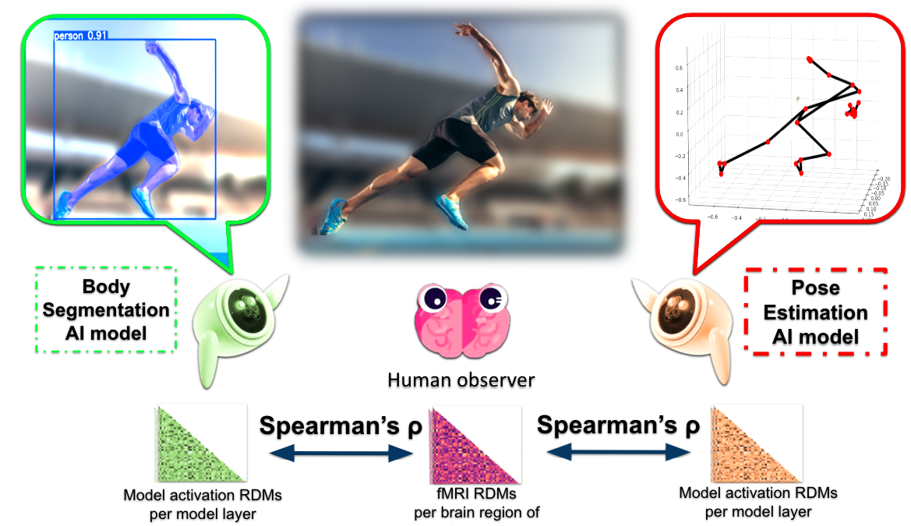

# BodyNet2Brain

Mapping representations in the visual cortex with body-parsing neural networks

The purpose of this study is to unravel representations in visual cortical regions with body-parsing neural networks (i.e., pose estimation and body segmentation models). Specifically, it aims to:

1. Perform Representational Similarity Analysis (RSA) between neural networks and visual cortical regions.
2. Conduct variance partitioning to determine the contributions of each neural network model to explaining the variance in the neural responses in visual cortical regions.

Hypotheses? Assumptions?

 # Project Structure: 

*create at the end*

Key stages of the project #

1. Extract lists of which out of ~4450 body-centric images from NSD dataset were shown to each subject.

Example?

2. Find corresponding fMRI activation patterns from visual cortex ROIs.

Example?

Model Feature Extraction3. 

Use YOLOv8-based models for pose and segmentation tasks.
or sapiens, mention other tasks. 

4. Extract layer-wise features for each image.

5. Representational Analysis

Run RSA to compare model features with neural RDMs.

Use variance partitioning to disentangle shared and unique variance6. .

Evaluation & Visualization7. 

Create bar plots of RSA values per region and model.

Plot variance Venn diagrams to show model overlaps.

Visualize searchlight RSA on cortical surface (glass brain).

Sample outputs:
Various graphs we got as results

# How To Use:
idk

# Code pipeline:

ROI segmentation:

Beta extraction:

RSA:

Variance Partitioning:

Plotting:

 # References: 
Allen et al., Nature Neuroscience (2022) – Natural Scenes Dataset

Zhu et al., PNAS (2024) – Body pose representation

Kriegeskorte et al., Frontiers in Systems Neuro (2008) – RSA

Downing et al., Science (2001) – Body-selective cortical areas

Redmon et al., CVPR (2016) – YOLO model

Dwivedi et al., JOCN (2021) – Scene parsing + brain mapping

